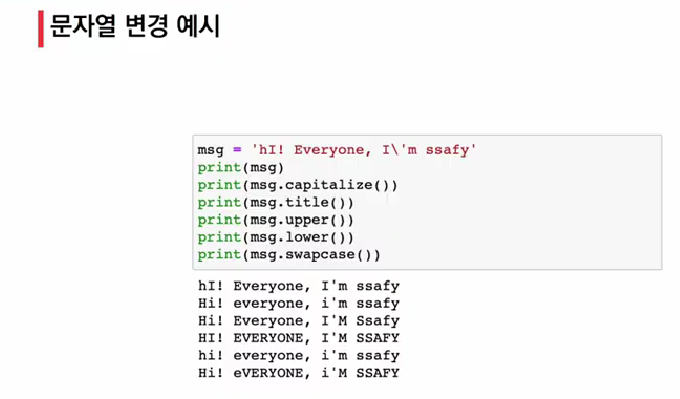

# 1. 문자열 조회/탐색 및 검증 메소드

```python
s.find() # x의 "첫 번째" 위치를 반환. 없으면 "-1"을 반환

'apple'.find('p')
1
'apple'.find('k')
-1


s.index() # x의 첫 번째 위치를 반환. 없으면 "오류" 발생 
## 딕셔너리의 .get()과 비슷함

s.isalpha() # 알파벳 문자 여부. 단순 알파벳이 아닌 유니코드 상 Letter("한국어"도 포함)

s.isupper() # 대문자 여부

s.islower() # 소문자 여부

s.istitle() # 타이틀 형식 여부

```


# 2. 문자열 변경 메소드

```python
s.replace(old, new[, count]) # 바꿀 대상 글자를 새로운 글자로 바꿔서 변환

s.strip([char]) # 공백이나 특정 문자를 제거

# strip : 양쪽 제거
# lstrip : 왼쪽 제거
# rstirp : 오른쪽 제거

s.split(sep=None, maxsplit=-1) # 공백이나 특정 문자를 기준으로 분리
## iterable에 문자열이 아닌 값이 있으면 TypeError 발생
'separator'.join([iterable]) # 구분자로 iterable을 합침


# '!'.join('ssafy')
# 's!s!a!f!y'

# ' '.join(['3', '5'])
# '3 5'

'''
 numbers = ['1', '2', '3']
 # print(number, end = ' ')
 # print(' '.join(numbers))

'''

s.capitalize() # 가장 첫 번째 글자를 대문자로 변경

s.title() # '나 공백 이후를 대문자로 변경

s.upper() # 모두 대문자로 변경

s.lower() # 모두 소문자로 변경

s.swapcase() # 대 <-> 소문자 서로 변경
```


# 3. 문자열 변경 예시




# 4. 리스트 메소드 - mutable(변경 가능함)

```python
L.append(x) # 리스트 마지막에 x를 추가
L.inser(i, x) # 리스트 인덱스 i에 항목 x를 삽입
L.remove(x) # 리스트 가장 왼쪽에 있는 항목(첫 번째) x를 제거
			# 항목이 존재하지 않을 경우, valueError
    
    # remove = 값을 삭제 
    # pop = 인덱스(위치)로 삭제

L.clear() # 모든 항목 삭제
L.pop() # 리스트 가장 오른쪽에 있는 항목(마지막)을 반환 후 제거
L.pop(i) # 리스트의 인덱스 i에 있는 항목을 반환 후 제거
L.extend(m) # 순회형 m의 모든 항목들의 리스트 끝에 추가(+=과 같은 기능)
L.index(x, start, end) # 리스트에 있는 항목 중 가장 왼쪽에 있는 항목 x의 인덱스를 반환
L.reverse() # 리스트를 거꾸로 정렬
L.sort() # 리스트를 정렬(매개변수 이용 가능)
L.count(x) # 리스트에서 항목 x가 몇 개 존재하는지 갯수를 반환

```

```python
a = [100, 10, 1, 5]

# 1. 메서드(.sort()) ## (리스트.sort())
print(a.sort())
### None 출력됨


# 2. 함수(sorted) ## (sorted(리스트))
print(sotred(b))
### [1, 5, 10, 100]


# =============================
print(a)
print(a.sort()) 
print(a)
>>> [100, 10, 1, 5]
>>> None ## 원본 자체를 정렬시키고 None을 리턴
>>> [1, 5, 10, 100]


print(a)
print(sorted(a))
print(a)
>>> [100, 10, 1, 5]
>>> [1, 5, 10, 100]
>>> [100, 10, 1, 5]

a = sorted(a)라고 만들어주고 print하면 [1, 5, 10, 100] 출력됨

# ================================


a = [100, 2, 6]
a.sort()
a.reverse()
print(a)
>>> [100, 6, 2]
```


# 5. 튜플(Tuple)

- 순서를 가지는 0개 이상의 자료형
- **변경 불가** !!
- append 이런 거 못 쓴다 (튜플이 바뀌기 때문에)
- 리스트 메소드 중 항목을 변경하는 메소드들을 제외하고 대부분 동일

```python
```


# 6. Set

- 순서없이 0개 이상의 해시 가능한 객체를 참조하는 자료형 (해시 가능한 자료(불변자료형)만 가능)
- 리스트, 딕셔너리 불가
- 담고 있는 객체를 삽입, 변경, 삭제 가능 -> 가변자료형(mutable)
- 수학에서 **집합**과 동일한 구조를 가짐
  - 집합 연산 가능
  - 중복된 값이 존재하지 않음

```python
s.copy() # 셋의 얕은 복사본을 반환
s.add() # 항목 x가 셋 s에 없다면 추가
s.pop() # 셋s에서 랜덤하게 항목을 반환하고, 해당 항목을 제거. set이 비어있을 경우 KeyError
s.remove(s) # 항목 x를 셋 s에서 삭제, 항목이 존재하지 않을 경우, keyError
s.discard(x) # 항목 x가 셋s에 있는 경우, 항목 x를 셋s에서 삭제
s.update(t) # 셋 t에 있는 모든 항목 중 셋 s에 없는 항목을 추가
s.clear() # 모든 항목을 제거
s.isdisjoint(t) # 셋s가 셋t의 서로 같은 항목을 하나라도 갖고 있지 않은 경우, True반환
s.issubset(t) #셋s가 셋t의 하위 셋인 경우, True 반환
s.issuperset(t) #셋s가 셋t의 상위 셋인 경우, True반환
```

