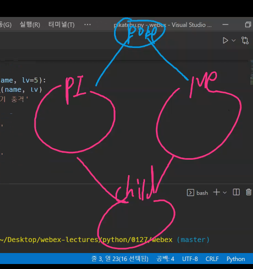

```python
# class 대문자로 시작하는 이름

class Person :
    
    # 생성자
    # 특별한 데코레이터가 없는 메서드는 인스턴스 메서드
    # 인스턴스의 속성, 혹은 값을 조작하는 행위를 위한 메서드
    # 첫 번째 인자로는 인스턴스 자신이 오게 될 것이다
    # self라는 이름은 관례적인 것이고, 바뀌어도 문제는 없다
    # 하지만 바꾸지는 않을 것이다.
    def __init__(self, name) :
        # 인스턴스 속성
        self.name = name
        
        
kim = Person('김구현')
# kim 인스턴스는 name 속성을 처음 생성할 때 할당되어서 가지게 된다
print(kim)
print(type(kim))
print(Person.name)

>>> 김구현
>>> <class '__main__.Person'>
>>> (공백) # Person이 가지고 있는 값은 없음

hong = Person('홍길동')
print(hong.name)

```

```python
# class 대문자로 시작하는 이름

class Person :
    # 클래스 속성
    population = 0
    
    def __init__(self, name) :
        # 인스턴스 속성
        self.name = name
        self.population += 1 #  이걸로 값 1 증가시켜 줄 수 있음
        # 하지만 인스턴스의 속성이 되어버렸기 때문에 1씩 계속 증가하는 게 아님, scope 잘 보면
        # kim, hong 자체의 속성이 되어버린 것이지 population 속성이 된 것이 아님
        # Person의 population은 변동 없이 0임
        
        Person.population += 1 # 하면 Person.population == 2가 됨
        # 되긴 되지만, 이 행위는 그냥 클래스의 population을 증가시킨 것
        # 그냥 밖에서(print 쓰는 줄에서) Person.populaion += 1 해준 것과 똑같음
        # 인스턴스 메서드에서 쓸 수 있는 건 self니까 그냥 self만 써라
        
kim = Person('김구현')
hong = Person('홍길동')
print(kim.population == hong.population)
>>> True

print(Person.population)
>>> 0

```

```python
# class 대문자로 시작하는 이름

class Person :
    # 클래스 속성
    population = 0
    
    def __init__(self, name) :
        # 인스턴스 속성
        self.name = name
        self.population += 1 
        
        Person.population += 1 
        
    @classmethod # 클래스 메서드 정의, @ 꼭 붙여줌
    def increase(cls) :
        cls.population += i
        

# 다른 창에서 실행 - 클래스 메서드지만 호출 가능

kim.increase() # 인스턴스 
kim = (Person.population)
>>> 1 # kim은 Person의 인스턴스이기 때문에, kim이 가지고 있는 상위 속성이 나옴

Person.increase() # 클래스로 호출
print(Person.population)
>>> 2

print(Person.population)
>>> 0

```

```python
# class 대문자로 시작하는 이름

class Person :
    # 클래스 속성
    population = 0
    
    def __init__(self, name) :
        # 인스턴스 속성
        self.name = name
        
    @classmethod # 클래스 메서드 정의, @ 꼭 붙여줌
    def increase(cls) :
        cls.population += i
        
class Human(Person) :
    pass


a = Human('휴먼')


# 다른 창에서 실행

print(a.name)
>>> 휴먼

print(a.population)
>>> 0

a.increase()
print(a.population)
>>> 1 # a의 population 증가

print(Person.population)
>>> 0 # 여전히 0임
# a는 Human 클래스의 인스턴스, a를 가지고 Person 클래스의 increase 호출할 떄,
# 서로 완전히 다른 클래스이기 때문에 Person의 population은 0, Human의 population은 1이 됨
# 함부로 Human 인스턴스의 a가 person 인스턴스의 정의를 바꿔서는 안 됨!


```

```python
# class 대문자로 시작하는 이름

class Person :
    # 클래스 속성
    population = 0
    
    def __init__(self, name) :
        # 인스턴스 속성
        self.name = name
        
    @classmethod # 클래스 메서드 정의, @ 꼭 붙여줌
    def increase(cls) : # 호출될 때 클레스 자체 메서드를 부여 받음
        cls.population += i
    
    @staticmethod # 이런 건 다 데코레이터임
    def decrease() :
        Person.population -= 1 # 상속 받았던 Human 클래스의 인스턴스도 바뀜
        # 왜냐면 Person 클래스의 population 자체를 건드는 것이기 때문
        # 밑에 프린트 해보면 자기 마음대로 이상한 값 집어 넗어져 있음
        # 근데 이런 짓 좀 하지 마라 암튼 Person.어쩌구 노노
        
        
class Human(Person) :
    pass


a = Human('휴먼')


# 다른 창에서 실행

print(a.name)
>>> 휴먼

print(a.population)
>>> 0

a.increase()
print(a.population)
>>> 1 # a의 population 증가

print(Person.population)
>>> 0 # 여전히 0임
# a는 Human 클래스의 인스턴스, a를 가지고 Person 클래스의 increase 호출할 떄,
# 서로 완전히 다른 클래스이기 때문에 Person의 population은 0, Human의 population은 1이 됨
# 함부로 Human 인스턴스의 a가 person 인스턴스의 정의를 바꿔서는 안 됨!


```

```python
# 앞에 점선 __ 두 개 넣으면 함수 내부에서는 저 메서드들 불러올 수 있음

class Person :
    # 클래스 속성
    population = 0
    
    def __init__(self, name) :
        # 인스턴스 속성
        self.name = name
        
    @classmethod 
    def increase(cls) : 
        cls.__population += i # 이렇게 해주면 됨
        
	p1 = Person('p1')
    >>> 1 # 클래스 내부에서 호출하고 있기 때문에 정상적으로 프린트되어 나옴
    
    
p1 = Person('p1')
>>> AttributeError # 함수 외부에서 호출하면 안 됨
Person.__popuation += 1 # 이것도 안 됨 AttributeError 
# 왜냐면 위에 __로 만들었잖음 ?? 그럼 내부에서만 호출해야 함
```

```python
# __name__은 파일명
# __main__은 이름
# 파일에 이런 이름이 있으면 실행시켜라 라는 의미

if __name__ == '__main__' :
    
```

```python
class Person :
    # 클래스 속성
    population = 0
    
    def __init__(self, name) :
        # 인스턴스 속성
        self.name = name
    def __del__(self) : # 소멸자
        
    @classmethod 
    def increase(cls) : 
        cls.__population += i
        
	p1 = Person('p1')
    >>> 1 # 클래스 내부에서 호출하고 있기 때문에 정상적으로 프린트되어 나옴
```

```python
__str__(self)
__len__(self)
__repr__(self)
__lt__(self, other)
__le__(self, other)
__eq__(self, other)
__gt__(self, other)
__ge__(self, other)
__ne__(self, other)

```

```python
class MyList :
    pass
a = list([1, 3, 4])
print(a)
>>> [1, 3, 4]

# ======================================

class MyList :
    def __init__(self, *args) :
        self.value = [*args] #언패킹해서 리스트로 감싸서 집어넣자
        
a = MyList(1, 2, 3, 4)
print(a.value)
>>> [1, 2, 3, 4]
b = MyList()
print(b.value)
>>> []
print(len(b.value))
>>> 0

class Test :
    
    def __init__(self) :
        self.value = 0
        
    def __len__(self) :
        result = 0
        for i in self.value :
            result += 1
            
        return result
    
        
        
a = MyList(1, 2, 3, 4)
print(a.value)
>>>> [1, 2, 3, 4]
print(len(a))
>>> 4
```

다중상속의 우선순위는 앞에 있는 것부터 됨



