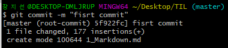
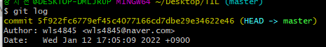
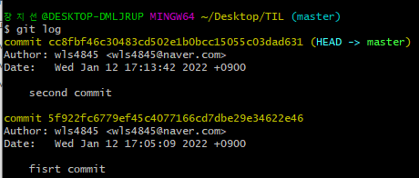

# 3. GIT

## 1) 초기 설정

- 최초 한 번만 설정

  1. 누가 커밋을 남겼는지 확인할 수 있도록 이름과 이메일 설정

     ```bash
     $ git config --global user.name 이름
     $ git config --global user.email 이메일
     ```

  

  2. 설정된 내용 확인

     ``` bash
     $ git config --global -list
     # or
     $ git config --global -l
     ```


## 2) 명령어

1. `git init`

   - 현재 작업 중인 directory git으로 관리
- **이미 master로 관리 중인 폴더 내에서 절대 절대 git init 금지**


2. `git status`

- Working directory와 Staging Area에 있는 파일들의 현재 상태 확인
- **수시로 확인해 줄 것!**
- 상태
  1. `untracked` : git이 관리하지 않는 파일. 오직 directory 안에만 있는 것
  2. `tracked` : git이 관리하는 파일
     - `Unmodified` : 최신 상태
     - `Modified` : _수정되었지만_  Staging area에 반영되기 전 즉, 수정했으나 버전 commit 전.
       add 후 commit 해주면 됨
     - `staged` : Staging area에 반영된 상태


3. `git add`

   ```bash
   # 특정 파일
   $ git add file_name.txt
   
   # 특정 폴더
   $ git add folder/
   
   # 현재 디렉토리에 속한 모든 파일 / 폴더
   $ git add .
   
   ## . : 상대 경로에 위치하는 all
   ```


4. `git commit`
   - Staging area에 올라온 파일의 변경 사항을 하나의 버전으로 저장하는 명령어
   
   - `커밋 메세지` : 현재 변경사항을 기록하는 용도
   
     ```bash
     $ git commit -m "커밋 메세지"
     
     
     ```
   
   - `(root-commit)` : 최초의 commit
   
   - `5f922fc` : 커밋 버전의 고윳값 앞7자리 (원래는 더 길다)
   
     


5. `git log`

   - 커밋의 내역을 조회할 수 있는 명령어

   - 7자리만 나왔던 고윳값을 확인할 수 있음

     

     

     

   - 옵션

     1. `--oneline` : 한 줄로 축약해서 보여줌
     2. `--graph` : branch와 merge 내력을 그래프로 보여주는 명령어. 협업 시 작업이 분화되는 과정 보여줌
     3. `--all` : 모든 branch의 내역
     4. `--reverse` : 커밋 내역의 순서를 반대로 보여주는 명령어 (과거 버전부터 보여줌)
