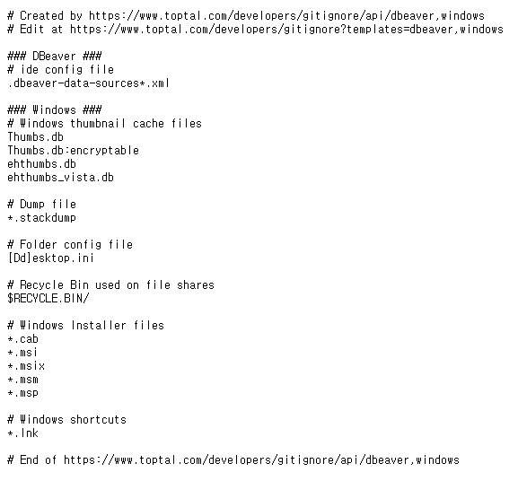

# 3. GIT

## 1) 초기 설정

- 최초 한 번만 설정

  1. 누가 커밋을 남겼는지 확인할 수 있도록 이름과 이메일 설정

     ```bash
     $ git config --global user.name 이름
     $ git config --global user.email 이메일
     ```

  

  2. 설정된 내용 확인

     ``` bash
     $ git config --global -list
     # or
     $ git config --global -l
     ```


## 2) 명령어

1. `git init`

   - 현재 작업 중인 directory git으로 관리
- **이미 master로 관리 중인 폴더 내에서 절대 절대 git init 금지**


2. `git status`

- Working directory와 Staging Area에 있는 파일들의 현재 상태 확인
- **수시로 확인해 줄 것!**
- 상태
  1. `untracked` : git이 관리하지 않는 파일. 오직 directory 안에만 있는 것
  2. `tracked` : git이 관리하는 파일
     - `Unmodified` : 최신 상태
     - `Modified` : _수정되었지만_  Staging area에 반영되기 전 즉, 수정했으나 버전 commit 전.
       add 후 commit 해주면 됨
     - `staged` : Staging area에 반영된 상태


3. `git add`

   ```bash
   # 특정 파일
   $ git add file_name.txt
   
   # 특정 폴더
   $ git add folder/
   
   # 현재 디렉토리에 속한 모든 파일 / 폴더
   $ git add .
   
   ## . : 상대 경로에 위치하는 all
   ```


4. `git commit`
   - Staging area에 올라온 파일의 변경 사항을 하나의 버전으로 저장하는 명령어
   
   - `커밋 메세지` : 현재 변경사항을 기록하는 용도
   
     ```bash
     $ git commit -m "커밋 메세지"
     
     
     ```
   
   - `(root-commit)` : 최초의 commit
   
   - `5f922fc` : 커밋 버전의 고윳값 앞7자리 (원래는 더 길다)
   
     


5. `git log`

   - 커밋의 내역을 조회할 수 있는 명령어

   - 7자리만 나왔던 고윳값을 확인할 수 있음

     

     

     

   - 옵션

     1. `--oneline` : 한 줄로 축약해서 보여줌
     2. `--graph` : branch와 merge 내력을 그래프로 보여주는 명령어. 협업 시 작업이 분화되는 과정 보여줌
     3. `--all` : 모든 branch의 내역
     4. `--reverse` : 커밋 내역의 순서를 반대로 보여주는 명령어 (과거 버전부터 보여줌)


## 3) git .ignore

1. 생성 방법

   - `$ touch .ignore`로 생성 후 메모장으로 파일 열기

     

     

     1. git이 다루지 않을 파일명 입력

     

     

     2. git status 쳐보면 지정한 파일 무시되는 걸 알 수 있음 (untracked files)

     

   

   

   - `gitignore.io`  사이트

     1. git에서 관리하면 안 되는 내용들 다 작성

     

     

     2. 방금 만들었던 `.ignore` 파일에 복사 & 붙여넣기

     


2. 생성 위치
   - **working directory의 최상단**


3. 생성 기간
   - **작업 시작 시 바로 만들 것**


4. `assume-unchanged`

   - 원격 저장소에도 파일이 있고, 로컬에도 이미 있고, 이미 트래킹 중인 파일을
     **로컬에서만 더이상 추적하지 않도록** 설정

     ```bash
     $ git update-index --assume-unchanged {file name}
     ```

   

5. `cached`

   - 로컬에 있는 파일 변동 추적 멈춤

   - 원격 저장소에 해당 파일이 이미 있다면 그 파일 삭제 (**원격 저장소에 push할 때 해당 파일 삭제**)

     ```bash
     $ git rm --cached {file name}
     ```

     

6. `git rm`

   - 로컬, 원격 저장소 **모두 파일 삭제 후 추적 중지**

     ``` bash
     $ git rm {file name}
     ```

     


## 4) 원격저장소에 있는 파일 

1. `clone`

- git 레포지토리를 내 로컬에 세팅

  1. git - repository - code 복사

     

     

  2. 바탕화면 - 오른쪽 마우스 클릭 - Git bash here

  3. `git clone 복사한 코드` 입력

     

  

  4. 레포지토리 폴더 생긴 것 알 수 있음

     

     

     

  

2. `pull`

- 원격 저장소에 있는 버전이 내 로컬에 있는 버전보다 최신 버전이라면
  로컬 저장소에 원격 저장소의 버전을 내려 받음

- 즉, 원격저장소가 업데이트 되었을 때,
  **원격저장소 - 로컬저장소의 환경을 원격저장소에 동일하게 맞춰줌**

  

  1. 원격저장소 - 로컬저장소 상태 **같을** 경우
     원격저장소가 로컬저장소보다 **구버전**일 경우

     

     - Already up to date 확인

  

  

  

  2. 원격저장소가 로컬저장소보다 **최신 버전**인 경우

     - repository

       

       

     - local

       

       

     - git pull 입력 시

       

       

       

       - 원격저장소(repository)에 있는 Homework 파일이 TIL 폴더에 생성된 걸 알 수 있음

     

     

  3. 원격저장소와 로컬저장소의 버전이 일치하지 않을 때

     

     - push되지 않는 걸 확인할 수 있음
     - `hint`를 보면 ('git pull ...') -> pushing 전 `git pull`로 환경을 맞춰달라는 문구가 보임

