# 4. Git Repository로 끝말잇기 하기

## [나 : 끝말잇기 할 파일 저장소에 올리기]   

1. new repository 생성  

   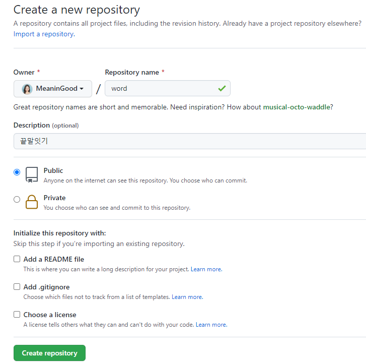
   
   

2. 내 컴퓨터에 세팅해주기

   - Word 폴더 생성 - 폴더 내에서 Git bash here 클릭

     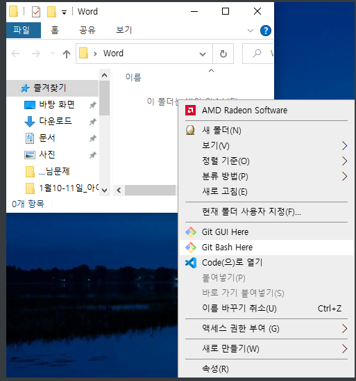

     

     

   - `$ git init` 으로 초기화

   - `$ touch word.md`로 끝말잇기 할 파일 생성

   - `$ start word.md`로 만든 파일 실행

     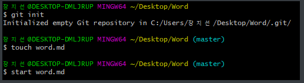

     

     

   - 끝말잇기 할 단어 쓰고 저장

     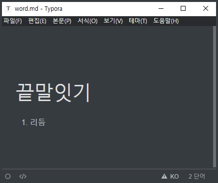

     

     

   - `$ git status`로 확인

     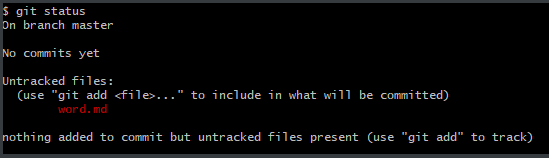

     

     

   - ` add - commit` 해 줌

     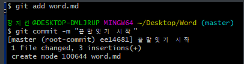

     

     

   - `$ git remote add origin https://github.com/MeaninGood/word.git` 으로 저장소 등록
   
   - $ git remote -v`로 확인
   
     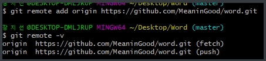
   
     
   
     
   
   - `$ git push -u origin master` 
   
     - **첫 저장 시**에만 `-u` 붙여줌!!
     - 이후 생략 가능
   
     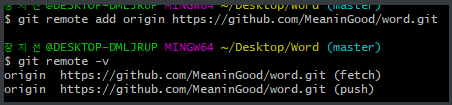
   
     
   
     
   
   - Repository 확인 - 생성 완료
   
     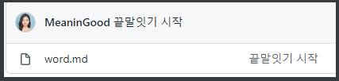
   
     
     
     

3. 만든 repository에 상대방 초대하기 - 내 Repository를 상대방이 자유롭게 쓸 수 있음

   - `Setting - Manage access - Add people` 로 상대방 초대하기

     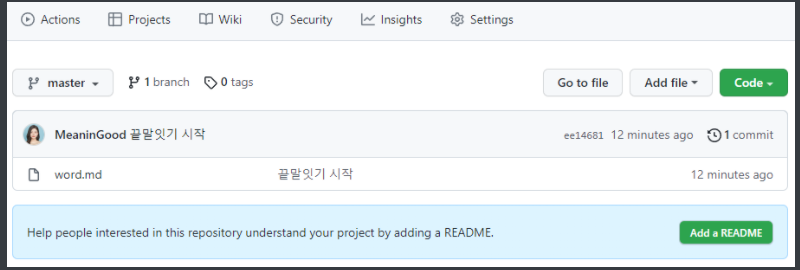

     

     
     
     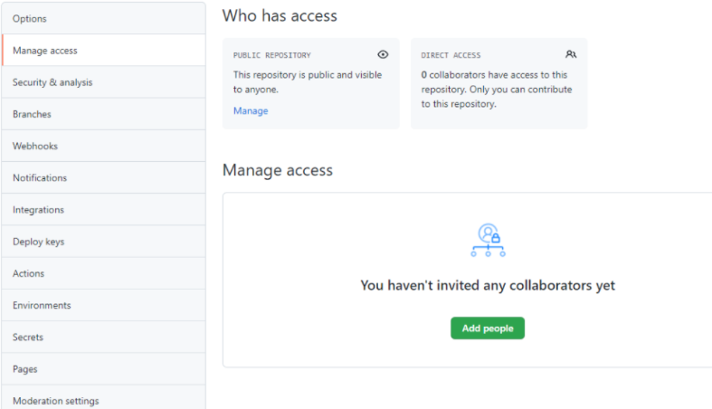
     
     

## [상대방 : 끝말잇기할 저장소 가져오기]

1. `$  git clone {레포지토리 주소}` 로 저장소 본인 로컬로 복제

   
   
   

2. 끝말잇기 연결한 후 ` add - commit - push`로 업로드

   

## [서로 `git pull`로 업데이트 된 것 확인하며 이어가기]

- `word.md` 파일 껐다 켰다 하며 확인

- or `git bash`창에서 `$ git pull` 입력

  - 변경 사항 없을 때 : `Already up to date.`라고 나옴

    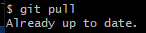

    
  
  - 변경 사항 있을 때 : 변경 내역 뜸
  
    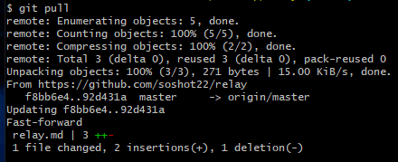
    
    
    
    
