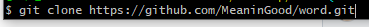
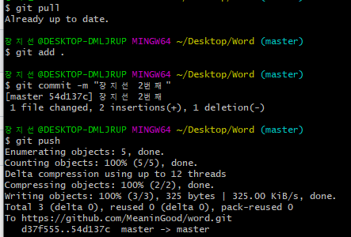
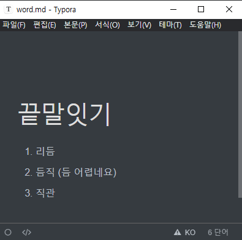

# 4. Git Repository로 끝말잇기 하기


## [나 : 끝말잇기 할 파일 저장소에 올리기]

1. new repository 생성

   


2. 내 컴퓨터에 세팅해주기

   - Word 폴더 생성 - 폴더 내에서 Git bash here 클릭

     

     

   - `$ git init` 으로 초기화

   - `$ touch word.md`로 끝말잇기 할 파일 생성

   - `$ start word.md`로 만든 파일 실행

     

     

   - 끝말잇기 할 단어 쓰고 저장

     

     

   - `$ git status`로 확인

     

     

   - ` add - commit` 해 줌

     

     

   - `$ git remote add origin https://github.com/MeaninGood/word.git` 으로 저장소 등록

   - $ git remote -v`로 확인

     

     

   - `$ git push -u origin master` 

     - **첫 저장 시**에만 `-u` 붙여줌!!
     - 이후 생략 가능

     

     

   - Repository 확인 - 생성 완료

     

     


3. 만든 repository에 상대방 초대하기 - 내 Repository를 상대방이 자유롭게 쓸 수 있음

   - `Setting - Manage access - Add people` 로 상대방 초대하기

     

     

     


## [상대방 : 끝말잇기할 저장소 가져오기]

1. `$  git clone {레포지토리 주소}` 로 저장소 본인 로컬로 복제

   


2. 끝말잇기 연결한 후 ` add - commit - push`로 업로드

   


## [나 : `git pull`로 업데이트된 내역 확인, 이어가기]

- `word.md` 파일 껐다 켰다 하며 확인!







## orgin

- 내 원격저장소 주소의 `별명` , 관례상 origin으로 씀

- 내 컴퓨터에 있는 git을 웹상의 github에 연결해주어야 함

  ```bash
  $ git remote add origin https://github.com/MeaninGood/word.git
  
  git의 {원격저장소}에 {추가}할 건데 {별명은 origin}이고 {주소}는 이거다.
  
  # 주소 길게 쓰기 귀찮으니까 주소에 별명 달아줌
  # 한번 지정해두면 git remote add til https://github.com/MeaninGood/word.git로 지정 후
  # 이후 git remote add til만 해줘도 됨
  ```

  