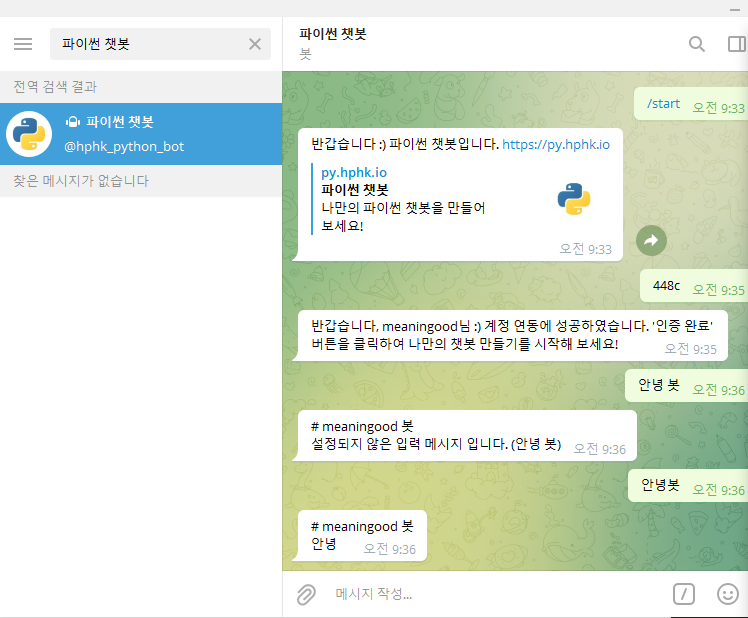
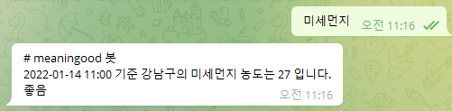

# 6_Python 챗봇 만들기


## 1)  Telegram 챗봇 설치

1. 텔레그램 설치

   - 텔레그램 설치 -> 회원가입

   - 왼쪽 상단에서 파이썬 챗봇 검색

     


- 채팅창의 링크 눌러서 회원 가입 -> 받은 코드를 채팅창에 써주면 연동 완료

- 채팅 입력해보기

  


2. 챗봇 만들기가 쉬워진 이유

   - 프로그래밍 언어가 쉬워짐

     

   - 프로그래밍 환경이 좋아짐

     

     1. 과거 : 모든 것을 스스로 제작

        - 기술 생산자 == 기술 활용자

          Microsoft, Samsung

          

     2. 현재 : 이미 만들어진 것을 활용 (**오픈소스**)

        - **오픈소스**

          제작자의 권리를 지키면서, 누구나 코드 열람이 가능한, 오픈 소스 라이센스 등장

          공동 참여 프로젝트들이 생겨나는 등의 생태계가 구성됨

          카카오톡 - 설정 - 고객센터 / 도움말 - 오픈소스 라이선스

           

        - 기술 이해만 있다면 누구든 활용 가능

          Google Tensorflow, AWS, IBW Watson


## 2) Python

- 쉽다

- 많은 사람들이 사용한다

- 많은 것을 할 수 있다

  

- 무조건 최신 버전만 설치하지 않는 이유

  - **LTS(Long Term Support)**
    1. 장기 지원 버전
    2. 일반적인 경우보다 장기간에 걸쳐 지원하도록 특별히 고안된 소프트웨어의 버전, 에디션
    3. 안정성 측면에서 검증된 버전을 사용하기 위함 + 유지보수 기간 연장

  

- Visual Studio Code와 굳이 연동하는 이유

  1. 좀 더 가벼움
  2. 다양한 언어의 내용 제공
  3. 하이라이팅 기능 (색 바뀌는 기능) 제공
  4. 오픈소스 기능도 활발하게 되어 있음


### 주의사항

1. 대 / 소문자
2. 띄어쓰기
3. 스펠링


## 3) Python 문법

1. 저장

   - save의 개념보다는, **박스에 이름을 붙이고 어떤 값을 담는다** 라고 생각

   - ex) `dust = 60`  : dust = 60이다 (x), dust에 60을 저장(할당)한다 (o)

   - `dust == 60` : dust에 저장된 값은 60과 같다

     

   - 저장하는 것

     1. 숫자 : 현실세계에 존재하는 모든 숫자(글자가 들어가면 안 됨), 연산 가능
     2. 글자 : **따옴표**로 둘러싼 글자 or 숫자
     3. 참/거짓 : `True, False` ,  조건 / 반복에 사용됨

     

   - 어떻게 저장하는가

     1. 변수(variable) - 박스 1개

        - print(hello) : hello 변수에 담긴 내용 출력

        - print('hello') : 'hello'라는 글자 출력

          

     2. 리스트(list) - 박스 여러 개

        - dust = [45, 34, 13]

        - print(dust[1]) : 34 출력

          

     3. 딕셔너리(dictionary) - 라벨 붙인 박스

        - dust = { '영등포구' : 58, '종로구' : 30 }

        - print(dust)

          

2. 조건 (if / else)

   - if dust > 50 : 
     	print('50초과')

   - else : 
         print('50이하')

     ```python
     미세먼지 농도가 150보다 크다면 '매우나쁨' 출력
     150이하 80초과면 '나쁨' 출력
     80이하 30초과면 '보통' 출력
     아니면 '좋음' 출력
     
     if dust > 150 :
         print('매우나쁨')
     
     elif 150 >= dust > 80 :
         print('나쁨')
     
     elif 80 >= dust and dust > 30 :
         print('보통')
     
     else :
         print('좋음')
     ```

     

     

     

3. 반복

   - while True :
     print( '계속해주세요.' )

     ```python
     # while에 해당하는 조건일 동안 계속 반복
     
     # 1
     n = 0
     while n < 3 :
         print('출력')
         n = n + 1
         
     '''
     출력
     출력
     '''
     
     
     
     # 2
     dust = [59. 24. 102, 45, 64]
     n = 0
     while n < 3 :
         print(dust[n])
         n += 1
         
     '''
     59
     24
     102
     '''
     ```

     

   - for i in  List :
     print(i)

     ```python
     # 정해진 박스 내에서의 반복 시 사용
     # '가지고 있는 모든 것을 꺼낸다'
     
     # 1
     dust = [59, 24, 102]
     for i in dust :
         print(i)
         
     '''
     59
     24
     102
     '''
     ```


4. python 함수

   1. Built-in Functions (내장함수)

      - print, len, max 등

   2. Non-built-in Functions

      - 모듈 활용 (random) -- import random

        ```python
        '''
        < import 시 주의할 점 >
        
        # import : 가지고 오는 행위
        
        이 이후로 활용할 코드를 가지고 올 것이기 때문에
        import는 항상 최상단에 작성
        '''
        
        # random.choice(변수명)
        
        import random # 1. random 모듈 inport
        
        menu = ['짜장면', '짬뽕', '탕수육'] # 2. 리스트 생성
        
        choice = random.choice(menu) # 3. menu 중 하나를 무작위로 선택
        
        print(choice) # 4. 무작위 메뉴 나옴
        
        '''
        탕수육
        '''
        
        
        
        
        # random.sample(리스트, 개수) - 비복원추출
        
        import random
        
        numbers = list(range(1, 46))
        
        lotto = random.sample(numbers, 6)
        print(lotto)
        
        '''
        1, 45, 2, 4, 19, 35
        '''
        ```

      - 


## 4) 챗봇 실습

1. 미세먼지 - 조건문 ( if )

   ```python
   import requests
   from bs4 import BeautifulSoup
   
   KEY = 'pxMYp9JSAcMSOWwfcT71Z8sOqMrNPrQqbdZwIbx03u8bzY65gKa8oDNXF1ACao8V6NJAFFPFTdFK3ojdHq%2BR4A%3D%3D'
   url = f'http://apis.data.go.kr/B552584/ArpltnInforInqireSvc/getCtprvnRltmMesureDnsty?serviceKey={KEY}&numOfRows=10&pageNo=3&sidoName=서울&ver=1.0'
   # -> f'로 문자열 포맷팅
   ## print(f'{변수} 어쩌고')
   ## print('{} 어쩌고'.format(변수))
   
   
   
   # print(url)
   response = requests.get(url).text
   data = BeautifulSoup(response, 'xml')
   # print(data)
   item = data('item')[7]
   time = item.dataTime.text
   station = item.stationName.text
   dust = int(item.pm10Value.text)
   
   print(f'{time} 기준 {station}의 미세먼지 농도는 {dust} 입니다.')
   
   if dust > 150 :
       print('매우나쁨')
   
   elif 150 >= dust > 80 :
       print('나쁨')
   
   elif 80 >= dust > 30 :
       print('보통')
   
   else :
       print('좋음')
   
   ```

   


2. 로또

   ```python
   # requests 불러오기
   import requests
   
   # requests 사용해서 로또 api에 데이터 요청
   url = 'https://www.dhlottery.co.kr/common.do?method=getLottoNumber&drwNo=997'
   response = requests.get(url).json()
   
   # url에서 ? 뒤에 작성되는 내용 : ? 전의 주소로 요청을 보냄
   # ? 뒤의 값을 담아서
   # 값이 여러 개 일 때 &로 구분
   
   ## method=getLottoNumber
   ## drwNo=997
   ## 두 개 요청한 상태
   
   # requests.get(response)
   
   # 요청 보내서 응답 받은 문서를 출력
   print(response)
   
   # 당첨 번호 정보를 리스트에 담기
   winners = []
   
   
   # 1~7까지 반복
   for num in range(1, 7) :
       print(response[f'drwtNo{num}']) # key 값에 해당하는 values 출력
       # winners 리스트에 당첨번호 추가
       winners.append(response[f'drwtNo{num}'])
   print(winners)
   ```

   


## 5) API 활용하기

1. API

   - **요청**(정보를 원하는 사람) -- (주소)-->

   - <--(문서`HTML / JSON 등`)-- **응답**(정보를 주는 사람)

     

   - JSON(JavaScript Object Notation)

     - 데이터만을 주고 받기 위한 표기법
     - 파이썬의 Dictionary와 List 구조로 쉽게 변환하여 활용 가능


2. 사용법 - 로또

   ```python
   # requests 불러오기
   import requests
   
   # requests 사용해서 로또 api에 데이터 요청
   url = 'https://www.dhlottery.co.kr/common.do?method=getLottoNumber&drwNo=997'
   response = requests.get(url).json()
   
   # url에서 ? 뒤에 작성되는 내용 : ? 전의 주소로 요청을 보냄
   # ? 뒤의 값을 담아서
   # 값이 여러 개 일 때 &로 구분
   
   ## method=getLottoNumber
   ## drwNo=997
   ## 두 개 요청한 상태
   
   # requests.get(response)
   
   # 요청 보내서 응답 받은 문서를 출력
   print(response)
   
   # 당첨 번호 정보를 리스트에 담기
   winners = []
   
   
   # 1~7까지 반복
   for num in range(1, 7) :
       print(response[f'drwtNo{num}']) # key 값에 해당하는 values 출력
       # winners 리스트에 당첨번호 추가
       winners.append(response[f'drwtNo{num}'])
   print(winners)
   ```


3. 나이 예측하기

   ```python
   # requests 불러오기
   # 나이 예측 api 사용
   # 특정 이름을 입력했을 때 무작위 나이를 가져와서
   # 'oo의 나이는 oo살 입니다' 라는 문자열 출력
   
   import requests
   
   
   name = input('이름을 입력해 주세요 : ')
   url = f'https://api.agify.io/?name={name}'
   
   response = requests.get(url).json()
   
   age = response['age']
       
   print(f'{name}의 나이는 {age}살 입니다.')
   ```

   


